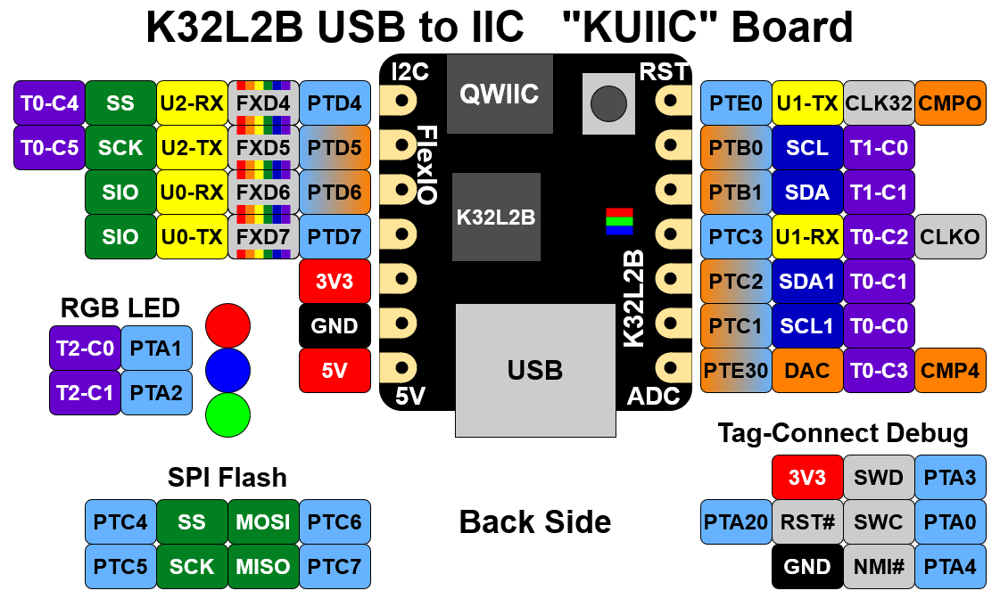

# KUIIC

## K32L2B USB to IIC Kit

This board is a tiny USB to Qwiic development board in a bread-board friendly DIP form factor.  In addition to micro USB and Qwiic connectors, it also has two buttons, SPI flash and two rows of 100mil pitch header footprints for additional expansion.  The MCU is an NXP K32L2B Arm Cortex-M0+ with crystal-less USB and integrated VBUS to 3V regulator.  

